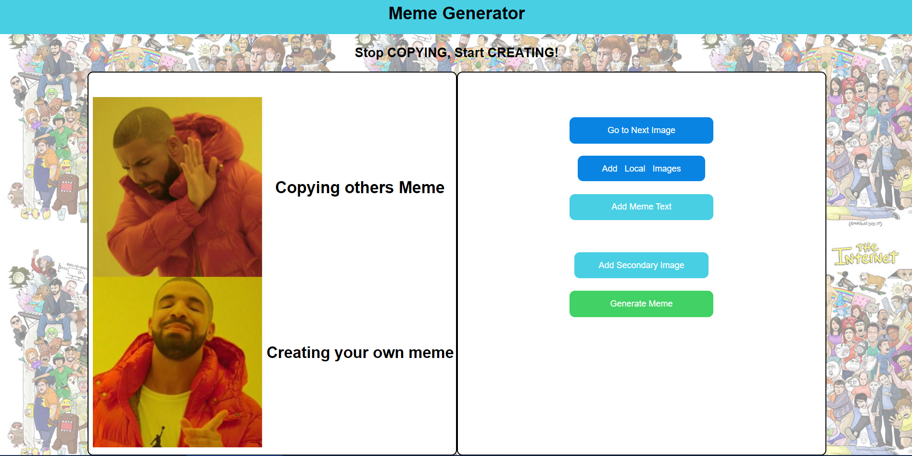

# Custom-Meme-Maker 
<br>

<p align="center">
    
</p>

It's a free online meme maker that lets you add custom resizable text, images, and much more to templates. Yes! The Custom Meme Maker is a flexible tool for many purposes. By uploading custom images and using all the customizations, you can design many creative works including memes, posters, and other advertisements.

### Live Demo - [Custom-Meme-Maker](https://custom-meme-maker.web.app/)

---

### Table of Contents

- [Description](#description)
- [Demo](#demo)
- [Project Layout](#project-layout)
- [References](#references)
- [Author Info](#author-info)

---

## Description

Memes made easy. Our meme maker is all you need to make the funniest video memes online. Use your own videos or stock, add meme text and share.
Choose a template. You can use one of the popular templates, search through more than 1 million user-uploaded templates using the search input, or hit "Add local template" to upload your own template from your device.
Add customizations. Add text, images, stickers, drawings, and spacing using the buttons beside your meme canvas.
Create, download and share. Hit "Generate Meme" and then choose how to share and save your meme. You can share to social apps or through your phone, or share a link, or download to your device.

### Technologies

- Firebase 
- React JS
- Material UI
- API

---


## Demo

<br>

### Using trending meme templates
<br>
<p align="center">
    
</p>

<br>

### Using your own Template

<br/>
<p align="center">
    
</p>


---

## Project Layout
<br />

```
Custom-Meme-Maker
├─ .firebase
│  └─ hosting.YnVpbGQ.cache
├─ .firebaserc
├─ .git
├─ .gitignore
├─ build
│  └─ static
│     ├─ css
│     └─ js
├─ firebase.json
├─ package-lock.json
├─ package.json
├─ public
│  └─ index.html
├─ README.md
└─ src
   ├─ App.js
   ├─ EditableText.js
   ├─ index.js
   └─ styles.css

```
---

## References

- [React JS](https://reactjs.org/)
- [Firebase](https://firebase.google.com/)
- [Imgflip API](https://imgflip.com/)

---

## Author Info

- LinkedIn - [Dwaraka Poreddy](https://www.linkedin.com/in/dwarakanath-reddy-poreddy-3bbb231b1/)
- Github - [Dwaraka Poreddy](https://github.com/Dwaraka-Poreddy)

#### [Back To The Top](#Custom-Meme-Maker )


